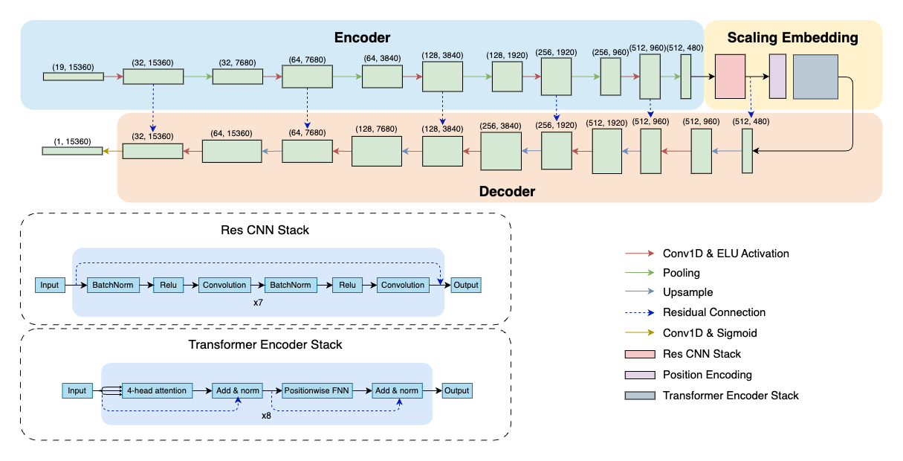

# Large EEG-U-Transformer for Time-Step Level Detection Without Pre-Training
This repository is the official implementation of "Large EEG-U-Transformer for Time-Step Level Detection Without Pre-Training". It contains the model that won **1st place** in the [2025 seizure detection challenge](https://epilepsybenchmarks.com/challenge/) organized in the International Conference on Artificial Intelligence in Epilepsy and Other Neurological Disorders.



# Reference
If you find our model useful, please cite our paper:
```
@article{wu2025large,
  title={Large EEG-U-Transformer for Time-Step Level Detection Without Pre-Training},
  author={Wu, Kerui and Zhao, Ziyue and Yener, B{\"u}lent},
  journal={arXiv preprint arXiv:2504.00336},
  year={2025}
}
```

## Abstract
Electroencephalography (EEG) reflects the brain's functional state, making it a crucial tool for diverse detection applications like seizure detection and sleep stage classification. While deep learning-based approaches have recently shown promise for automated detection, traditional models are often constrained by limited learnable parameters and only achieve modest performance. In contrast, large foundation models showed improved capabilities by scaling up the model size, but required extensive time-consuming pre-training. Moreover, both types of existing methods require complex and redundant post-processing pipelines to convert discrete labels to continuous annotations. In this work, based on the multi-scale nature of EEG events, we propose a simple U-shaped model to efficiently learn representations by capturing both local and global features using convolution and self-attentive modules for sequence-to-sequence modeling. Compared to other window-level classification models, our method directly outputs predictions at the time-step level, eliminating redundant overlapping inferences. Beyond sequence-to-sequence modeling, the architecture naturally extends to window-level classification by incorporating an attention-pooling layer. Such a paradigm shift and model design demonstrated promising efficiency improvement, cross-subject generalization, and state-of-the-art performance in various time-step and window-level classification tasks in the experiment. More impressively, our model showed the capability to be scaled up to the same level as existing large foundation models that have been extensively pre-trained over diverse datasets and outperforms them by solely using the downstream fine-tuning dataset. Our model won 1st place in the 2025 "seizure detection challenge" organized in the International Conference on Artificial Intelligence in Epilepsy and Other Neurological Disorders.

## Docker Image
The model used for the competition have been packed to a docker image, you can download here
```bash
docker pull yujjio/seizure_transformer
```

## Environment
For the seizure detection experiment, we use `Python=3.10.16`. Use the following command to set the environment:
```bash
conda create -n seizure python=3.10.16
conda activate seizure
pip install -r ./requirements_time_step.txt
```
For window-level classification tasks, including sleep stage classification and pathological detection, use the following command:
```bash
conda create -n window python=3.9.21
conda activate window
pip install -r ./requirements_window.txt
```

## Dataset

### Seizure Detection
#### Siena Scalp EEG Database
- 📥 **Download:** [Siena Scalp EEG Database on PhysioNet](https://physionet.org/content/siena-scalp-eeg/1.0.0/)
- 📂 **Save location:** `./time_step_level/data`
- 🛠 **Next step:** `cd ./time_step_level` and run `python3 get_dataset.py`

---

#### TUH EEG Seizure Corpus v2.0.3
- 📥 **Download:** [TUSZ v2.0.3](https://isip.piconepress.com/projects/nedc/html/tuh_eeg/#c_tueg)
- 📂 **Save location:** `./time_step_level/data`
- 🛠 **Next step:** `cd ./time_step_level` and run `python3 get_dataset.py`

---

### Sleep Stage Classification

#### 🛌 Sleep-EDFx
- 📥 **Download:** `cd ./window_level/datasets` and run `python3 prepare_sleep.py`
- 📂 **Save location:** `./window_level/datasets/sleep_edf_full`

---

### Pathological (Abnormal) Detection

#### TUH Abnormal EEG Corpus v3.0.1
- 📥 **Download:** [TUAB: v3.0.1](https://isip.piconepress.com/projects/nedc/html/tuh_eeg/#c_tueg)
- 📂 **Save location:** `./window_level/datasets`
- 🛠 **Next step:** `cd ./window_level/abonrmal/dataset_maker` and run `python3 make_TUAB.py`


## Experiments
### Seizure Detection
Training:
```bash
cd ./time_step_level
python3 train_sd.py
```
Evaluation:
```bash
cd ./time_step_level
python3 eval_test.py
```
### Sleep Stage Detection
```bash
cd ./window_level/sleep
python3 st_train.py
```

### Abnormal Detection
```bash
cd ./window_level/abnormal
./st_tuab.sh
```
